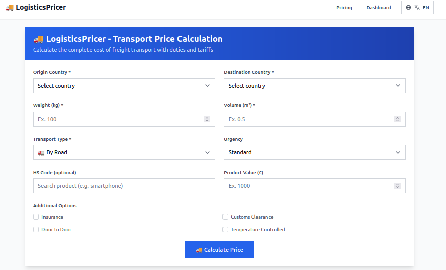

# LogisticsPricer - Freight Transport Cost Calculation System

[](https://nodejs.org/)
[](https://www.typescriptlang.org/)
[](https://reactjs.org/)
[](https://www.mongodb.com/)
[](https://expressjs.com/)
[](https://tailwindcss.com/)
[](https://creativecommons.org/licenses/by-nc/4.0/)
[]()
[]()
[]()
[]()

A complete MERN stack application for calculating international freight transport costs, with management of duties, tariffs, transport routes and pricing. **Fully internationalized** with Italian and English support.



## 🚀 Main Features

### ✅ Fully Integrated Modules

#### 1. **Shipping Routes Management** ⭐ **COMPLETE**
- ✅ Complete CRUD for transport routes
- ✅ Origin/destination country management
- ✅ Transit time calculation (base, customs, port congestion)
- ✅ Cost management (base, customs, port, additional)
- ✅ Advanced filters and pagination
- ✅ Modal forms for creation/modification
- ✅ Route statistics dashboard
- ✅ Restrictions and requirements management
- ✅ **Fully Internationalized UI**

#### 2. **Pricing Management** ⭐ **COMPLETE**
- ✅ **Pricing Request Management**: Complete CRUD for pricing calculation requests
- ✅ **Pricing Response Management**: Calculation results visualization
- ✅ **Advanced Statistics**: Dashboard with metrics and charts
- ✅ **Smart Filters**: Search by city, product, HS Code, status, transport type
- ✅ **Pagination**: Large data volume management
- ✅ **Complete Form**: Request creation/modification with validation
- ✅ **Automatic Calculation**: Integration with existing pricing algorithm
- ✅ **Fully Internationalized UI**

#### 3. **Tariff Management** ⭐ **COMPLETE**
- ✅ Complete CRUD for international tariffs
- ✅ Origin/destination country management
- ✅ Base and special tariffs (anti-dumping)
- ✅ Effective and expiry dates
- ✅ Filters and pagination
- ✅ Modal forms for creation/modification
- ✅ HS Code and tariff validation
- ✅ **Fully Internationalized UI**

#### 4. **USA Duties Management** ⭐ **COMPLETE**
- ✅ Complete CRUD for USA duties
- ✅ Section 301, 232, 201 management
- ✅ Search by HS Code and product description
- ✅ Advanced statistics and filters
- ✅ Modern React interface
- ✅ Modal forms for creation/modification
- ✅ **Fully Internationalized UI**

### 🔧 Technical Features

- **RESTful Backend API** with TypeScript
- **React Frontend** with Tailwind CSS
- **MongoDB Database** with Mongoose
- **Complete Data Validation**
- **Robust Error Handling**
- **Loading States** and user feedback
- **Responsive Design** for all devices
- **TypeScript Strict Mode** with exactOptionalPropertyTypes

### 🌍 Internationalization (i18n) ⭐ **COMPLETE**

- **Multi-language Support**: Italian and English
- **Frontend**: react-i18next with automatic language detection
- **Backend**: i18next with HTTP header-based language detection
- **Language Switching**: Real-time UI language toggle
- **Organized Translations**: Namespace-based structure (common, admin)
- **Fallback System**: Automatic fallback to English
- **Complete Coverage**: All UI elements, error messages, API responses

**Supported Languages:**
- 🇮🇹 **Italian** (it) - Default
- 🇺🇸 **English** (en) - Fallback

**Fully Internationalized Components:**
- ✅ **AdminDashboard**: Complete UI translation
- ✅ **TariffManagement**: All forms, tables, filters
- ✅ **PricingManagement**: Complete interface translation
- ✅ **USDutiesManagement**: All admin functions
- ✅ **ShippingRouteManagement**: Full CRUD interface
- ✅ **Analytics**: Dashboard and statistics
- ✅ **ShippingRouteStats**: Statistics interface
- ✅ **PricingStats**: Statistics dashboard
- ✅ **Language Switch**: Real-time language toggle

**Features:**
- ✅ Automatic browser language detection
- ✅ Persistent language preference (localStorage)
- ✅ Real-time language switching
- ✅ Localized error messages
- ✅ API response localization
- ✅ Complete UI translation coverage
- ✅ Namespace-based organization
- ✅ Interpolation support
- ✅ Fallback mechanisms

For detailed i18n documentation, see [I18N_GUIDE.md](docs/I18N_GUIDE.md)

## 📊 Implemented Modules

### 1. Shipping Routes Management

#### Available API Endpoints
- `GET /api/v1/shipping/routes` - Route list with filters and pagination
- `GET /api/v1/shipping/routes/:id` - Single route details
- `POST /api/v1/shipping/routes` - Create new route
- `PUT /api/v1/shipping/routes/:id` - Update route
- `DELETE /api/v1/shipping/routes/:id` - Delete route
- `GET /api/v1/shipping/routes/stats` - Route statistics

#### Data Structure
```typescript
{
  routeId: string;
  originCountry: string;
  destinationCountry: string;
  transportType: 'road' | 'air' | 'sea' | 'rail' | 'multimodal';
  baseTransitTime: number; // days
  customsDelay: number; // days
  portCongestion: number; // days
  totalTransitTime: number; // automatically calculated
  restrictions: string[];
  requirements: {
    documents: string[];
    specialHandling: string[];
    certifications: string[];
  };
  costs: {
    baseCost: number;
    customsFees: number;
    portFees: number;
    additionalFees: number;
  };
  totalCost: number; // automatically calculated
  isActive: boolean;
  effectiveDate: Date;
  expiryDate?: Date;
  notes?: string;
  source: string;
}
```

### 2. Pricing Management

#### Available API Endpoints
- `GET /api/v1/pricing/requests` - Request list with filters and pagination
- `GET /api/v1/pricing/requests/:id` - Single request details
- `POST /api/v1/pricing/requests` - Create new request
- `PUT /api/v1/pricing/requests/:id` - Update request
- `DELETE /api/v1/pricing/requests/:id` - Delete request
- `GET /api/v1/pricing/requests/stats` - Request statistics
- `GET /api/v1/pricing/responses` - Response list with filters
- `GET /api/v1/pricing/responses/:id` - Single response details
- `POST /api/v1/pricing/calculate` - Calculate transport price

#### PricingRequest Data Structure
```typescript
{
  origin: { country: string; city: string; coordinates?: [number, number] };
  destination: { country: string; city: string; coordinates?: [number, number] };
  cargo: {
    weight: number; // kg
    volume: number; // m³
    dimensions: { length: number; width: number; height: number };
    hsCode: string;
    productDescription: string;
    value: number; // USD
    quantity: number;
  };
  transport: {
    type: 'road' | 'air' | 'sea' | 'rail' | 'multimodal';
    urgency: 'standard' | 'express' | 'urgent';
    specialRequirements: string[];
  };
  options: {
    insurance: boolean;
    customsClearance: boolean;
    doorToDoor: boolean;
    temperatureControlled: boolean;
  };
  status: 'pending' | 'calculated' | 'expired' | 'cancelled';
}
```

#### PricingResponse Data Structure
```typescript
{
  requestId: string;
  baseTransportCost: number;
  dutiesAndTariffs: {
    baseDuty: number;
    specialTariffs: number;
    totalDuties: number;
    appliedRates: Array<{ tariffId: string; rate: number; type: string; description: string }>;
  };
  additionalCosts: {
    customsClearance: number;
    documentation: number;
    insurance: number;
    handling: number;
    storage: number;
  };
  totalCost: number;
  breakdown: { transport: number; duties: number; fees: number; insurance: number; total: number };
  transitTime: { estimated: number; confidence: number; factors: string[] };
  validity: { from: Date; to: Date };
  notes: string[];
}
```

### 3. Tariff Management

#### Available API Endpoints
- `GET /api/v1/tariffs` - Tariff list with filters and pagination
- `GET /api/v1/tariffs/:id` - Single tariff details
- `POST /api/v1/tariffs` - Create new tariff
- `PUT /api/v1/tariffs/:id` - Update tariff
- `DELETE /api/v1/tariffs/:id` - Delete tariff
- `GET /api/v1/tariffs/stats` - Tariff statistics

#### Data Structure
```typescript
{
  originCountry: string;
  destinationCountry: string;
  hsCode: string; // format: XXXX.XX.XX
  baseRate: number; // percentage
  specialRate?: number; // percentage for special tariffs
  effectiveDate: Date;
  expiryDate?: Date;
  source: 'WTO' | 'CUSTOMS_API' | 'MANUAL' | 'TRADE_AGREEMENT';
  isActive: boolean;
  notes?: string;
}
```

### 4. USA Duties Management

#### Available API Endpoints
- `GET /api/v1/usa-duties` - Duty list with filters
- `GET /api/v1/usa-duties/:id` - Single duty details
- `POST /api/v1/usa-duties` - Create new duty
- `PUT /api/v1/usa-duties/:id` - Update duty
- `DELETE /api/v1/usa-duties/:id` - Delete duty

#### Data Structure
```typescript
{
  hsCode: string;
  productDescription: string;
  baseRate: number; // percentage
  section301Rate?: number; // percentage
  section232Rate?: number; // percentage
  section201Rate?: number; // percentage
  effectiveDate: Date;
  expiryDate?: Date;
  source: 'USTR' | 'DOC' | 'CBP' | 'MANUAL';
  isActive: boolean;
  notes?: string;
}
```

## 🛠️ Installation and Setup

### Prerequisites
- Node.js 18+
- MongoDB 6+
- npm or yarn

### 1. Clone Repository
```bash
git clone <repository-url>
cd logisticsPricer
```

### 2. Setup Backend
```bash
cd backend
npm install
npm run build
```

### 3. Setup Frontend
```bash
cd frontend
npm install
```

### 4. Database Configuration
```bash
# Start MongoDB (if not already running)
sudo systemctl start mongod

# Or use Docker
docker run -d -p 27017:27017 --name mongodb mongo:6
```

### 5. Start Application

#### Option 1: Automatic Scripts
```bash
# Start everything (backend + frontend + MongoDB)
./start.sh

# Stop everything
./stop.sh

# MongoDB management
./db.sh start
./db.sh stop
./db.sh status
```

#### Option 2: Manual
```bash
# Terminal 1: Backend
cd backend
npm run dev

# Terminal 2: Frontend  
cd frontend
npm run dev

# Terminal 3: MongoDB (if needed)
mongod
```

## 🌐 Application Access

- **Frontend**: http://localhost:5173
- **Backend API**: http://localhost:5000
- **Health Check**: http://localhost:5000/health
- **API Docs**: http://localhost:5000/api/v1

## 📁 Project Structure

```
logisticsPricer/
├── backend/
│   ├── src/
│   │   ├── controllers/
│   │   │   ├── usaDutiesController.ts ✅
│   │   │   ├── tariffController.ts ✅
│   │   │   ├── pricingController.ts ✅
│   │   │   └── shippingController.ts ✅
│   │   ├── models/
│   │   │   ├── USDuty.ts ✅
│   │   │   ├── TariffRate.ts ✅
│   │   │   ├── PricingRequest.ts ✅
│   │   │   ├── PricingResponse.ts ✅
│   │   │   ├── ShippingRoute.ts ✅
│   │   │   └── DutyCalculation.ts ✅
│   │   ├── routes/
│   │   │   ├── usaDuties.ts ✅
│   │   │   ├── tariffs.ts ✅
│   │   │   ├── pricing.ts ✅
│   │   │   ├── shipping.ts ✅
│   │   │   ├── auth.ts
│   │   │   └── users.ts
│   │   ├── services/
│   │   ├── middleware/
│   │   ├── config/
│   │   ├── types/
│   │   └── utils/
│   └── package.json
├── frontend/
│   ├── src/
│   │   ├── components/
│   │   │   ├── admin/
│   │   │   │   ├── AdminDashboard.tsx ✅
│   │   │   │   ├── USDutiesManagement.tsx ✅
│   │   │   │   ├── TariffManagement.tsx ✅
│   │   │   │   ├── TariffForm.tsx ✅
│   │   │   │   ├── PricingManagement.tsx ✅
│   │   │   │   ├── PricingStats.tsx ✅
│   │   │   │   ├── ShippingRouteManagement.tsx ✅
│   │   │   │   ├── ShippingRouteStats.tsx ✅
│   │   │   │   └── Analytics.tsx ✅
│   │   │   └── business/
│   │   │       ├── PricingCalculator.tsx ✅
│   │   │       ├── PricingForm.tsx ✅
│   │   │       └── PricingResult.tsx ✅
│   │   ├── services/
│   │   │   ├── usaDutiesService.ts ✅
│   │   │   ├── tariffService.ts ✅
│   │   │   ├── pricingService.ts ✅
│   │   │   └── shippingService.ts ✅
│   │   ├── types/
│   │   │   └── pricing.ts ✅
│   │   └── App.tsx
│   └── package.json
├── docs/
├── scripts/
├── config/
├── start.sh
├── stop.sh
├── db.sh
└── README.md
```

## 🎯 Available Features

### Admin Dashboard
- **Shipping Routes Management**: Complete CRUD with filters and statistics
- **Customs Tariff Management**: Complete CRUD with validation
- **USA Duties Management**: Complete CRUD with section filters
- **Pricing Request Management**: Complete CRUD with statistics dashboard
- **Analytics**: Dashboard with metrics and charts

### Price Calculation
- **Calculation Form**: Interface for shipping data input
- **Automatic Calculation**: Integration with pricing algorithms
- **Detailed Results**: Complete cost breakdown
- **Request History**: Management and visualization of previous requests

## 🔄 Next Modules to Integrate

- [ ] **User Management & Authentication**
- [ ] **Document Management**
- [ ] **Advanced Reporting & Analytics**
- [ ] **Notifications & Email**
- [ ] **Data Import/Export**
- [ ] **External Integration APIs**

## 🐛 Troubleshooting

### Common Issues

1. **MongoDB Connection Error**
   ```bash
   # Check MongoDB status
   ./db.sh status
   
   # Restart MongoDB
   ./db.sh restart
   ```

2. **Port Already in Use**
   ```bash
   # Find process using the port
   lsof -i :5000
   lsof -i :5173
   
   # Kill process
   kill -9 <PID>
   ```

3. **Build Errors**
   ```bash
   # Clean and reinstall
   cd backend && npm run clean && npm install
   cd frontend && rm -rf node_modules && npm install
   ```

4. **TypeScript Errors**
   ```bash
   # Check TypeScript build
   cd frontend && npm run build
   cd backend && npm run build
   ```

## 📝 Development Notes

- All modules follow the same integration pattern
- RESTful API with complete validation
- Frontend with state management, loading and error handling
- Database with optimized Mongoose models
- Modern and responsive user interface
- TypeScript Strict Mode with exactOptionalPropertyTypes
- Robust date and optional type handling

## 🚀 Deploy

### Docker
```bash
# Build and start with Docker Compose
docker-compose up -d

# Stop
docker-compose down
```

### Kubernetes
```bash
# Deploy to K8s cluster
kubectl apply -f k8s/
```

## 🤝 Contributions

1. Fork the project
2. Create feature branch (`git checkout -b feature/AmazingFeature`)
3. Commit changes (`git commit -m 'Add some AmazingFeature'`)
4. Push to branch (`git push origin feature/AmazingFeature`)
5. Open Pull Request

# License

This project is licensed under the Creative Commons Attribution-NonCommercial 4.0 International License (CC-BY-NC-4.0) - see the [LICENSE](LICENSE) file for details.

This license allows you to:
- ✅ Use, modify, and distribute the software
- ❌ Use it for commercial purposes
- ✅ Attribute the original author

For commercial use, please contact the author